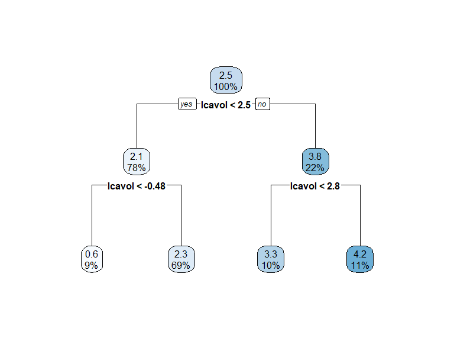
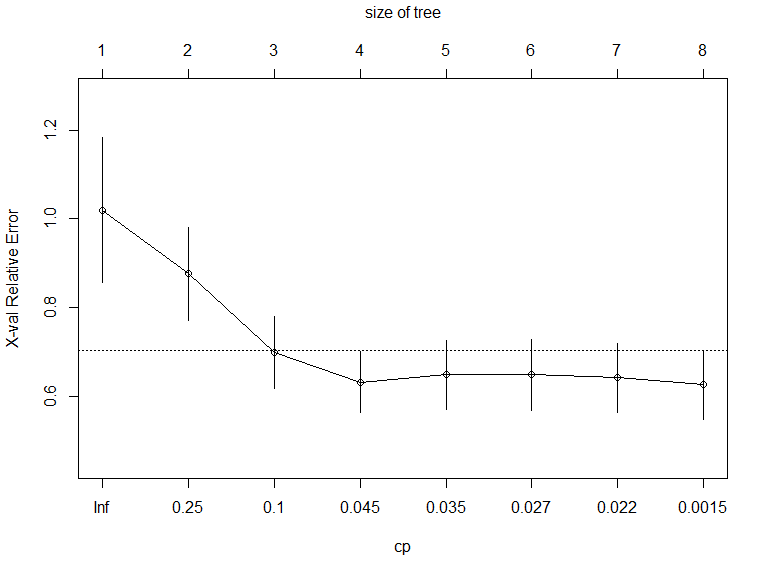
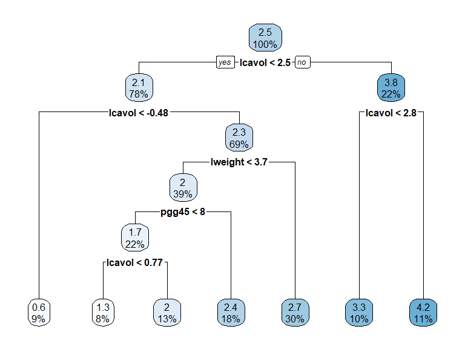
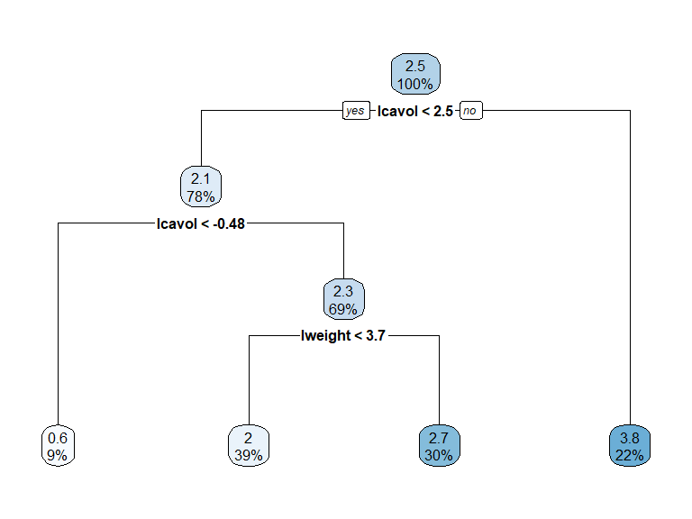

p8106\_hw4\_jsg2145
================
Jared Garfinkel
4/25/2020

``` r
library(lasso2)
```

    ## R Package to solve regression problems while imposing
    ##   an L1 constraint on the parameters. Based on S-plus Release 2.1
    ## Copyright (C) 1998, 1999
    ## Justin Lokhorst   <jlokhors@stats.adelaide.edu.au>
    ## Berwin A. Turlach <bturlach@stats.adelaide.edu.au>
    ## Bill Venables     <wvenable@stats.adelaide.edu.au>
    ## 
    ## Copyright (C) 2002
    ## Martin Maechler <maechler@stat.math.ethz.ch>

``` r
data(Prostate)

x <- model.matrix(lpsa~.,Prostate)[,-1]
y <- Prostate$lpsa
```

``` r
tree1 <- rpart(lpsa~., Prostate, control = rpart.control(cp = .0001))
rpart.plot(tree1)
```



``` r
tree1$cptable
```

    ##           CP nsplit rel error    xerror       xstd
    ## 1 0.34710828      0 1.0000000 1.0195570 0.16352153
    ## 2 0.18464743      1 0.6528917 0.8755917 0.10419631
    ## 3 0.05931585      2 0.4682443 0.6979037 0.08101762
    ## 4 0.03475635      3 0.4089284 0.6310759 0.06925404
    ## 5 0.03460901      4 0.3741721 0.6475306 0.07792255
    ## 6 0.02156368      5 0.3395631 0.6481889 0.08000104
    ## 7 0.02146995      6 0.3179994 0.6415899 0.07776212
    ## 8 0.00010000      7 0.2965295 0.6258878 0.07778125

``` r
cpTable <- printcp(tree1)
```

    ## 
    ## Regression tree:
    ## rpart(formula = lpsa ~ ., data = Prostate, control = rpart.control(cp = 1e-04))
    ## 
    ## Variables actually used in tree construction:
    ## [1] lcavol  lweight pgg45  
    ## 
    ## Root node error: 127.92/97 = 1.3187
    ## 
    ## n= 97 
    ## 
    ##         CP nsplit rel error  xerror     xstd
    ## 1 0.347108      0   1.00000 1.01956 0.163522
    ## 2 0.184647      1   0.65289 0.87559 0.104196
    ## 3 0.059316      2   0.46824 0.69790 0.081018
    ## 4 0.034756      3   0.40893 0.63108 0.069254
    ## 5 0.034609      4   0.37417 0.64753 0.077923
    ## 6 0.021564      5   0.33956 0.64819 0.080001
    ## 7 0.021470      6   0.31800 0.64159 0.077762
    ## 8 0.000100      7   0.29653 0.62589 0.077781

``` r
plotcp(tree1)
```



``` r
minErr <- which.min(cpTable[,4])
# minimum cross-validation error
tree3 <- prune(tree1, cp = cpTable[minErr,1])
# 1SE rule
tree4 <- prune(tree1, cp = cpTable[cpTable[,4]<cpTable[minErr,4]+cpTable[minErr,5],1][1])

rpart.plot(tree3)
```



``` r
rpart.plot(tree4)
```



``` r
ctrl1 = trainControl(method = "repeatedcv", number = 10, repeats = 5)

set.seed(22)
tree_caret_cv = train(x, y, method = "rpart",
                   tuneGrid = data.frame(cp = seq(.001, 1, length = 1000)),
                   trControl = ctrl1)

tree_caret_cv$bestTune
```

    ##       cp
    ## 13 0.013

``` r
ggplot(tree_caret_cv, highlight = TRUE)
```


``` r
tree_caret_cv$finalModel$cptable
```

    ##           CP nsplit rel error
    ## 1 0.34710828      0 1.0000000
    ## 2 0.18464743      1 0.6528917
    ## 3 0.05931585      2 0.4682443
    ## 4 0.03475635      3 0.4089284
    ## 5 0.03460901      4 0.3741721
    ## 6 0.02156368      5 0.3395631
    ## 7 0.02146995      6 0.3179994
    ## 8 0.00000000      7 0.2965295

``` r
rpart.plot(tree_caret_cv$finalModel)
```


``` r
set.seed(22)
tree_caret_1se <- train(x, y,
                   method = "rpart",
                   tuneGrid = data.frame(cp = seq(.001, 1, length = 1000)), 
                   trControl = trainControl(method = "repeatedcv", number = 10, repeats = 5,
                                            selectionFunction = "oneSE"))

tree_caret_1se$bestTune
```

    ##       cp
    ## 25 0.025

``` r
ggplot(tree_caret_1se, highlight = TRUE) + theme_bw()
```


``` r
tree_caret_1se$finalModel$cptable
```

    ##           CP nsplit rel error
    ## 1 0.34710828      0 1.0000000
    ## 2 0.18464743      1 0.6528917
    ## 3 0.05931585      2 0.4682443
    ## 4 0.03475635      3 0.4089284
    ## 5 0.03460901      4 0.3741721
    ## 6 0.02500000      5 0.3395631

``` r
rpart.plot(tree_caret_1se$finalModel)
```


``` r
set.seed(22)
resamp <- resamples(list(minErr = tree_caret_cv,
                         oneSE = tree_caret_1se))
summary(resamp)
```

    ## 
    ## Call:
    ## summary.resamples(object = resamp)
    ## 
    ## Models: minErr, oneSE 
    ## Number of resamples: 50 
    ## 
    ## MAE 
    ##             Min.   1st Qu.    Median      Mean   3rd Qu.     Max. NA's
    ## minErr 0.4519217 0.6201402 0.7089144 0.7244433 0.8258116 1.010807    0
    ## oneSE  0.4712642 0.6527670 0.7582356 0.7366359 0.8261562 1.010807    0
    ## 
    ## RMSE 
    ##             Min.   1st Qu.    Median      Mean   3rd Qu.     Max. NA's
    ## minErr 0.5366273 0.7021520 0.8576688 0.8494137 0.9487340 1.171649    0
    ## oneSE  0.5739553 0.7572611 0.8939170 0.8716841 0.9600888 1.165925    0
    ## 
    ## Rsquared 
    ##                Min.   1st Qu.    Median      Mean   3rd Qu.      Max. NA's
    ## minErr 1.444536e-05 0.3509990 0.4734469 0.4871524 0.6473874 0.8345701    0
    ## oneSE  2.321338e-02 0.3337917 0.4426040 0.4561976 0.6124944 0.8016926    0
