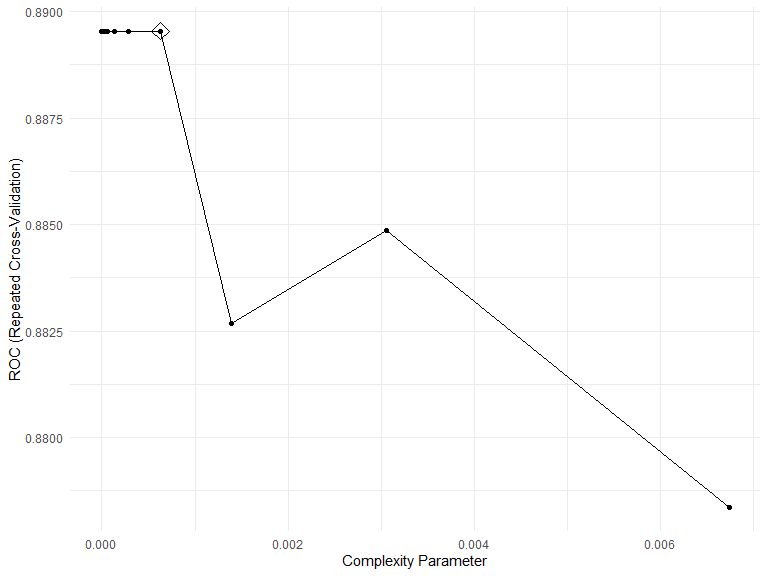
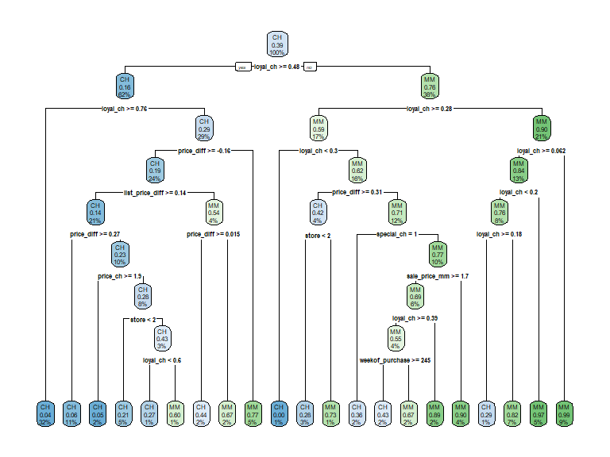
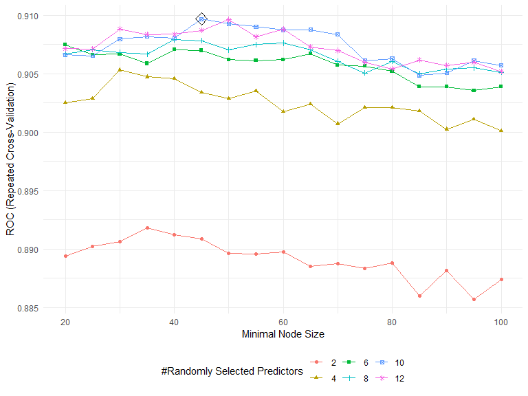
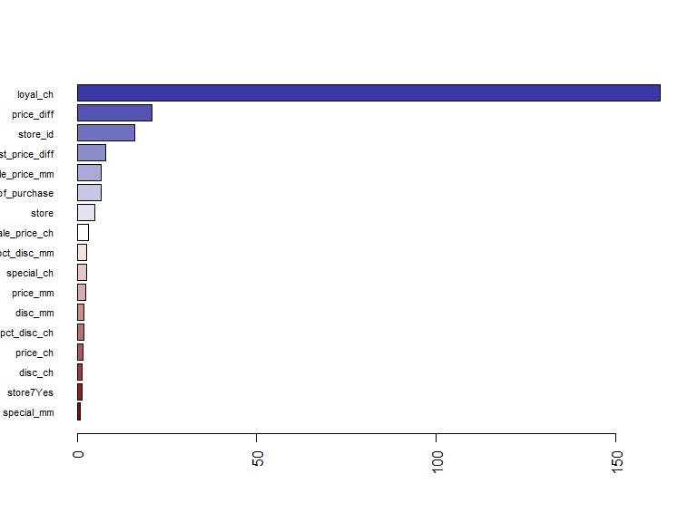

p8106\_hw4\_jsg2145
================
Jared Garfinkel
4/25/2020

## Part a

``` r
library(lasso2)
```

    ## R Package to solve regression problems while imposing
    ##   an L1 constraint on the parameters. Based on S-plus Release 2.1
    ## Copyright (C) 1998, 1999
    ## Justin Lokhorst   <jlokhors@stats.adelaide.edu.au>
    ## Berwin A. Turlach <bturlach@stats.adelaide.edu.au>
    ## Bill Venables     <wvenable@stats.adelaide.edu.au>
    ## 
    ## Copyright (C) 2002
    ## Martin Maechler <maechler@stat.math.ethz.ch>

``` r
data(Prostate)

x <- model.matrix(lpsa~.,Prostate)[,-1]
y <- Prostate$lpsa
```

``` r
tree1 <- rpart(lpsa~., Prostate, control = rpart.control(cp = .0001))
rpart.plot(tree1)
```


``` r
tree1$cptable
```

    ##           CP nsplit rel error    xerror       xstd
    ## 1 0.34710828      0 1.0000000 1.0239079 0.16590150
    ## 2 0.18464743      1 0.6528917 0.8364174 0.11665043
    ## 3 0.05931585      2 0.4682443 0.7169904 0.09052948
    ## 4 0.03475635      3 0.4089284 0.6312852 0.08005862
    ## 5 0.03460901      4 0.3741721 0.6224298 0.07495009
    ## 6 0.02156368      5 0.3395631 0.6134590 0.07574108
    ## 7 0.02146995      6 0.3179994 0.6061013 0.07222397
    ## 8 0.00010000      7 0.2965295 0.6135333 0.07372440

``` r
cpTable <- printcp(tree1)
```

    ## 
    ## Regression tree:
    ## rpart(formula = lpsa ~ ., data = Prostate, control = rpart.control(cp = 1e-04))
    ## 
    ## Variables actually used in tree construction:
    ## [1] lcavol  lweight pgg45  
    ## 
    ## Root node error: 127.92/97 = 1.3187
    ## 
    ## n= 97 
    ## 
    ##         CP nsplit rel error  xerror     xstd
    ## 1 0.347108      0   1.00000 1.02391 0.165901
    ## 2 0.184647      1   0.65289 0.83642 0.116650
    ## 3 0.059316      2   0.46824 0.71699 0.090529
    ## 4 0.034756      3   0.40893 0.63129 0.080059
    ## 5 0.034609      4   0.37417 0.62243 0.074950
    ## 6 0.021564      5   0.33956 0.61346 0.075741
    ## 7 0.021470      6   0.31800 0.60610 0.072224
    ## 8 0.000100      7   0.29653 0.61353 0.073724

``` r
plotcp(tree1)
```


``` r
minErr <- which.min(cpTable[,4])
# minimum cross-validation error
tree3 <- prune(tree1, cp = cpTable[minErr,1])
# 1SE rule
tree4 <- prune(tree1, cp = cpTable[cpTable[,4]<cpTable[minErr,4]+cpTable[minErr,5],1][1])

rpart.plot(tree3)
```


``` r
rpart.plot(tree4)
```


``` r
ctrl1 = trainControl(method = "repeatedcv", number = 10, repeats = 5)

set.seed(22)
tree_caret_cv = train(x, y, method = "rpart",
                   tuneGrid = data.frame(cp = seq(.001, 1, length = 1000)),
                   trControl = ctrl1)

tree_caret_cv$bestTune
```

    ##       cp
    ## 13 0.013

``` r
ggplot(tree_caret_cv, highlight = TRUE)
```


``` r
tree_caret_cv$finalModel$cptable
```

    ##           CP nsplit rel error
    ## 1 0.34710828      0 1.0000000
    ## 2 0.18464743      1 0.6528917
    ## 3 0.05931585      2 0.4682443
    ## 4 0.03475635      3 0.4089284
    ## 5 0.03460901      4 0.3741721
    ## 6 0.02156368      5 0.3395631
    ## 7 0.02146995      6 0.3179994
    ## 8 0.00000000      7 0.2965295

``` r
rpart.plot(tree_caret_cv$finalModel)
```


``` r
set.seed(22)
tree_caret_1se <- train(x, y,
                   method = "rpart",
                   tuneGrid = data.frame(cp = seq(.001, 1, length = 1000)), 
                   trControl = trainControl(method = "repeatedcv", number = 10, repeats = 5,
                                            selectionFunction = "oneSE"))

tree_caret_1se$bestTune
```

    ##       cp
    ## 25 0.025

``` r
ggplot(tree_caret_1se, highlight = TRUE) + theme_bw()
```


``` r
tree_caret_1se$finalModel$cptable
```

    ##           CP nsplit rel error
    ## 1 0.34710828      0 1.0000000
    ## 2 0.18464743      1 0.6528917
    ## 3 0.05931585      2 0.4682443
    ## 4 0.03475635      3 0.4089284
    ## 5 0.03460901      4 0.3741721
    ## 6 0.02500000      5 0.3395631

``` r
rpart.plot(tree_caret_1se$finalModel)
```


``` r
set.seed(22)
resamp <- resamples(list(minErr = tree_caret_cv,
                         oneSE = tree_caret_1se))

ggplot(resamp)
```


``` r
summary(resamp)
```

    ## 
    ## Call:
    ## summary.resamples(object = resamp)
    ## 
    ## Models: minErr, oneSE 
    ## Number of resamples: 50 
    ## 
    ## MAE 
    ##             Min.   1st Qu.    Median      Mean   3rd Qu.     Max. NA's
    ## minErr 0.4519217 0.6201402 0.7089144 0.7244433 0.8258116 1.010807    0
    ## oneSE  0.4712642 0.6527670 0.7582356 0.7366359 0.8261562 1.010807    0
    ## 
    ## RMSE 
    ##             Min.   1st Qu.    Median      Mean   3rd Qu.     Max. NA's
    ## minErr 0.5366273 0.7021520 0.8576688 0.8494137 0.9487340 1.171649    0
    ## oneSE  0.5739553 0.7572611 0.8939170 0.8716841 0.9600888 1.165925    0
    ## 
    ## Rsquared 
    ##                Min.   1st Qu.    Median      Mean   3rd Qu.      Max. NA's
    ## minErr 1.444536e-05 0.3509990 0.4734469 0.4871524 0.6473874 0.8345701    0
    ## oneSE  2.321338e-02 0.3337917 0.4426040 0.4561976 0.6124944 0.8016926    0

## Part b

``` r
final_tree = rpart(formula = lpsa ~ ., data = Prostate, control = rpart.control(cp = 0.1))
rpart.plot(final_tree)
```


## Part c

``` r
bagging_grid <- expand.grid(mtry = 8,
                       splitrule = "variance",
                       min.node.size = 1:20)
set.seed(22)
bagging_fit <- train(x, y, 
                method = "ranger",
                tuneGrid = bagging_grid,
                trControl = ctrl1,
                importance = "impurity")

ggplot(bagging_fit, highlight = TRUE)
```


``` r
bagging_fit$results[which.min(bagging_fit$results[,5]),]
```

    ##    mtry splitrule min.node.size      RMSE  Rsquared       MAE    RMSESD
    ## 20    8  variance            20 0.7600798 0.5993522 0.6307274 0.1594892
    ##    RsquaredSD     MAESD
    ## 20  0.1557015 0.1432667

``` r
barplot(sort(ranger::importance(bagging_fit$finalModel), 
             decreasing = FALSE), 
        las = 2, 
        horiz = TRUE, 
        cex.names = 0.7,
        col = colorRampPalette(colors = c("darkred",
                                          "white",
                                          "darkblue"))(19))
```


## Part d

``` r
randfor_grid <- expand.grid(mtry = 1:7,
                       splitrule = "variance",
                       min.node.size = 1:15)
set.seed(22)
randfor_fit <- train(x, y, 
                method = "ranger",
                tuneGrid = randfor_grid,
                trControl = ctrl1,
                importance = 'permutation')

ggplot(randfor_fit, highlight = TRUE)
```


``` r
randfor_fit$results[which.min(randfor_fit$results[,5]),]
```

    ##    mtry splitrule min.node.size    RMSE  Rsquared       MAE    RMSESD
    ## 14    1  variance            14 0.79687 0.5607409 0.6386306 0.1956834
    ##    RsquaredSD     MAESD
    ## 14  0.1515241 0.1477475

``` r
barplot(sort(ranger::importance(randfor_fit$finalModel), decreasing = FALSE), 
        las = 2, horiz = TRUE, cex.names = 0.7,
        col = colorRampPalette(colors = c("darkred","white","darkblue"))(19))
```


## Part e

``` r
gbm_grid <- expand.grid(
  n.trees = seq(1, 5000, 100), 
  interaction.depth = 2:10,
  shrinkage = c(0.001,0.003,0.005), 
  n.minobsinnode = 1)

set.seed(22)
gbm_fit <- train(x, y,
                 method = "gbm",
                 tuneGrid = gbm_grid,
                 trControl = ctrl1,
                 verbose = FALSE)

ggplot(gbm_fit, highlight = T) + theme_bw()
```


``` r
summary(gbm_fit$finalModel, las = 2, cBars = 19, cex.names = 0.6)
```


    ##             var   rel.inf
    ## lcavol   lcavol 54.953514
    ## lweight lweight 17.796552
    ## svi         svi  7.396924
    ## pgg45     pgg45  5.933298
    ## lcp         lcp  5.624608
    ## age         age  4.381118
    ## lbph       lbph  2.419184
    ## gleason gleason  1.494802

## Part f

``` r
resamp2 = resamples(list(minErr = tree_caret_cv, 
                         min_1se = tree_caret_1se,
                         randomForest = randfor_fit,
                         boosting = gbm_fit))
summary(resamp2)
```

    ## 
    ## Call:
    ## summary.resamples(object = resamp2)
    ## 
    ## Models: minErr, min_1se, randomForest, boosting 
    ## Number of resamples: 50 
    ## 
    ## MAE 
    ##                   Min.   1st Qu.    Median      Mean   3rd Qu.      Max.
    ## minErr       0.4519217 0.6201402 0.7089144 0.7244433 0.8258116 1.0108066
    ## min_1se      0.4712642 0.6527670 0.7582356 0.7366359 0.8261562 1.0108066
    ## randomForest 0.3586373 0.5110769 0.6101846 0.6202786 0.6995581 0.9570076
    ## boosting     0.3662583 0.5171184 0.6064738 0.6124641 0.7035913 0.9653459
    ##              NA's
    ## minErr          0
    ## min_1se         0
    ## randomForest    0
    ## boosting        0
    ## 
    ## RMSE 
    ##                   Min.   1st Qu.    Median      Mean   3rd Qu.     Max.
    ## minErr       0.5366273 0.7021520 0.8576688 0.8494137 0.9487340 1.171649
    ## min_1se      0.5739553 0.7572611 0.8939170 0.8716841 0.9600888 1.165925
    ## randomForest 0.5098127 0.6130050 0.7267068 0.7512219 0.8499004 1.118397
    ## boosting     0.4278317 0.6470290 0.7257828 0.7483030 0.8626489 1.051423
    ##              NA's
    ## minErr          0
    ## min_1se         0
    ## randomForest    0
    ## boosting        0
    ## 
    ## Rsquared 
    ##                      Min.   1st Qu.    Median      Mean   3rd Qu.
    ## minErr       1.444536e-05 0.3509990 0.4734469 0.4871524 0.6473874
    ## min_1se      2.321338e-02 0.3337917 0.4426040 0.4561976 0.6124944
    ## randomForest 3.496955e-01 0.5102101 0.5926669 0.6082333 0.6851048
    ## boosting     3.563333e-01 0.4902781 0.6031274 0.6184048 0.7532405
    ##                   Max. NA's
    ## minErr       0.8345701    0
    ## min_1se      0.8016926    0
    ## randomForest 0.8995859    0
    ## boosting     0.9214752    0

``` r
bwplot(resamp2, metric = "RMSE")
```


# Problem 2

## Problem 2a

``` r
data(OJ)
oj_data = OJ %>% 
  janitor::clean_names()
# create a training set containing 800 obs
set.seed(22)
rowTrain = createDataPartition(y = oj_data$purchase,
                               p = 799/1070,
                               list = F)
train_data = oj_data[rowTrain, ]
test_data = oj_data[-rowTrain, ]
# check whether there is 800 obs
dim(train_data)
```

    ## [1] 800  18

``` r
x_train = train_data[,-1]
y_train = pull(train_data, purchase)

x_test = test_data[,-1]
y_test = pull(test_data, purchase)
```

``` r
ctrl2 <- trainControl(method = "repeatedcv",
                     summaryFunction = twoClassSummary,
                     classProbs = TRUE)
set.seed(22)

fit_oj_cv <- train(x_train, y_train,
                   method = "rpart",
                   tuneGrid = data.frame(cp = exp(seq(-20,-5, len = 20))),
                   trControl = ctrl2,
                   metric = "ROC")

ggplot(fit_oj_cv, highlight = TRUE)
```



``` r
# optimal tree size is 17 with smallest CV error
fit_oj_cv$finalModel$cptable
```

    ##            CP nsplit rel error
    ## 1 0.519230769      0 1.0000000
    ## 2 0.033653846      1 0.4807692
    ## 3 0.011217949      3 0.4134615
    ## 4 0.006410256      8 0.3429487
    ## 5 0.003205128     10 0.3301282
    ## 6 0.002136752     13 0.3205128
    ## 7 0.001602564     16 0.3141026
    ## 8 0.000000000     20 0.3076923

``` r
# plot of tree
rpart.plot(fit_oj_cv$finalModel)
```



``` r
# predict response on test data
pred = predict(fit_oj_cv, newdata = test_data,
               type = "raw");pred
```

    ##   [1] CH CH CH CH CH CH CH MM CH CH CH CH CH CH CH CH CH CH CH CH CH MM CH
    ##  [24] CH MM CH CH CH CH CH CH CH CH CH CH CH CH CH CH CH MM MM MM CH CH CH
    ##  [47] CH CH CH CH CH CH CH CH CH CH CH CH CH CH CH CH MM MM MM CH CH CH CH
    ##  [70] CH CH CH CH CH CH MM MM CH MM MM MM MM MM MM MM MM MM MM CH CH CH CH
    ##  [93] CH MM MM CH MM CH CH CH CH CH MM CH MM MM MM MM MM MM MM MM MM CH MM
    ## [116] CH MM MM MM MM MM MM CH CH MM CH CH CH MM MM CH CH CH CH CH MM CH MM
    ## [139] MM CH MM MM MM MM MM MM CH CH CH MM CH CH CH CH CH CH CH CH CH CH MM
    ## [162] CH CH CH MM MM MM CH CH CH CH CH CH MM MM CH CH MM MM MM MM MM MM MM
    ## [185] MM MM MM CH MM MM CH CH MM MM CH CH MM CH CH MM MM MM MM CH MM MM CH
    ## [208] MM CH CH CH CH CH CH CH CH CH CH MM MM MM MM MM MM CH CH CH CH CH CH
    ## [231] CH CH CH MM MM CH CH CH MM MM MM MM MM CH MM MM MM MM CH MM MM CH CH
    ## [254] CH CH CH CH MM CH MM MM CH CH CH CH MM CH CH CH CH
    ## Levels: CH MM

``` r
# test classification error rate
1 - mean(test_data$purchase == pred)
```

    ## [1] 0.2148148

## Part b

``` r
rf.grid_oj <- expand.grid(mtry = seq(2,12,2),
                       splitrule = "gini",
                       min.node.size = seq(20,100,5))
set.seed(1) 
rf.fit_oj <- train(purchase ~ ., train_data,
                method = "ranger",
                tuneGrid = rf.grid_oj,
                metric = "ROC",
                importance = "impurity",
                trControl = ctrl2)
# rf plot
ggplot(rf.fit_oj, highlight = TRUE)
```



``` r
# compare variable importance
barplot(sort(ranger::importance(rf.fit_oj$finalModel), decreasing = FALSE), 
        las = 2, horiz = TRUE, cex.names = 0.7,
        col = colorRampPalette(colors = c("darkred","white","darkblue"))(19))
```



``` r
# predict on test data
pred2 = predict(rf.fit_oj, newdata = test_data,
               type = "raw");pred
```

    ##   [1] CH CH CH CH CH CH CH MM CH CH CH CH CH CH CH CH CH CH CH CH CH MM CH
    ##  [24] CH MM CH CH CH CH CH CH CH CH CH CH CH CH CH CH CH MM MM MM CH CH CH
    ##  [47] CH CH CH CH CH CH CH CH CH CH CH CH CH CH CH CH MM MM MM CH CH CH CH
    ##  [70] CH CH CH CH CH CH MM MM CH MM MM MM MM MM MM MM MM MM MM CH CH CH CH
    ##  [93] CH MM MM CH MM CH CH CH CH CH MM CH MM MM MM MM MM MM MM MM MM CH MM
    ## [116] CH MM MM MM MM MM MM CH CH MM CH CH CH MM MM CH CH CH CH CH MM CH MM
    ## [139] MM CH MM MM MM MM MM MM CH CH CH MM CH CH CH CH CH CH CH CH CH CH MM
    ## [162] CH CH CH MM MM MM CH CH CH CH CH CH MM MM CH CH MM MM MM MM MM MM MM
    ## [185] MM MM MM CH MM MM CH CH MM MM CH CH MM CH CH MM MM MM MM CH MM MM CH
    ## [208] MM CH CH CH CH CH CH CH CH CH CH MM MM MM MM MM MM CH CH CH CH CH CH
    ## [231] CH CH CH MM MM CH CH CH MM MM MM MM MM CH MM MM MM MM CH MM MM CH CH
    ## [254] CH CH CH CH MM CH MM MM CH CH CH CH MM CH CH CH CH
    ## Levels: CH MM

``` r
# test error rate
1 - mean(test_data$purchase == pred2)
```

    ## [1] 0.1888889
